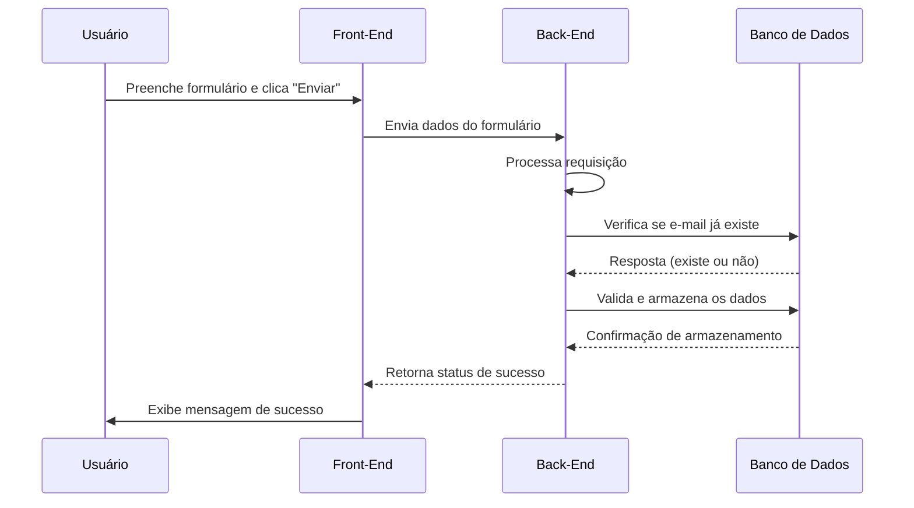
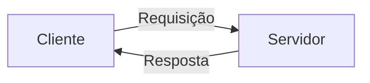
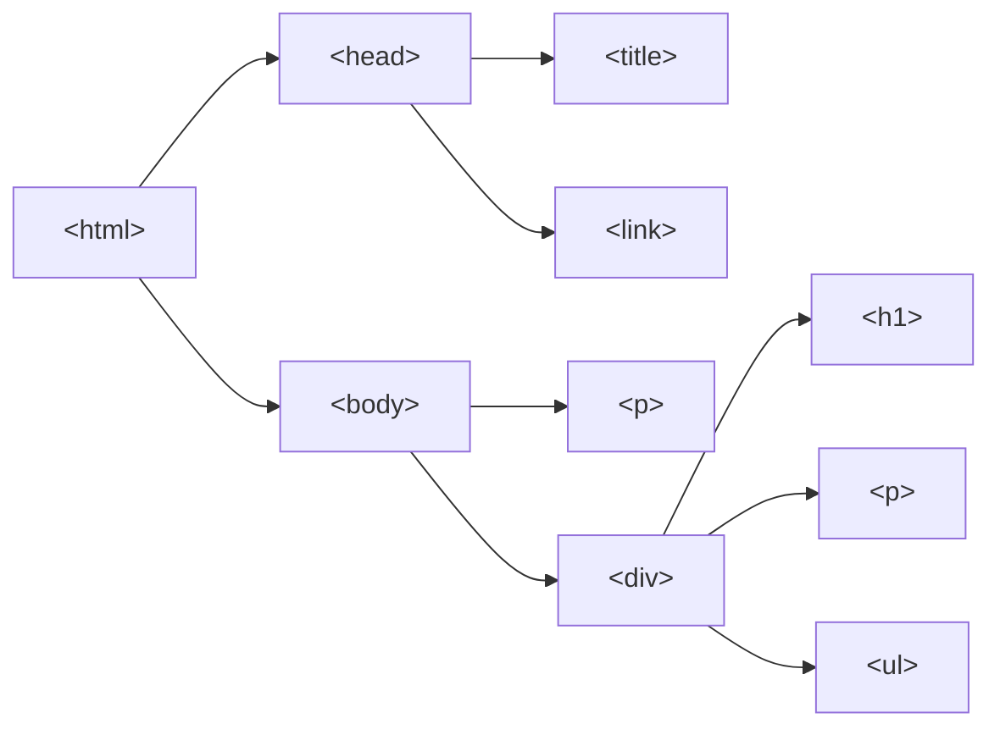
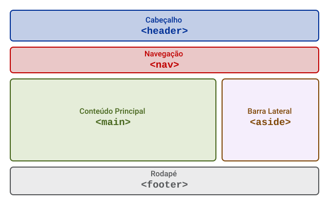
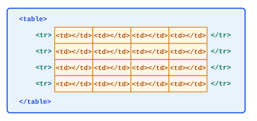
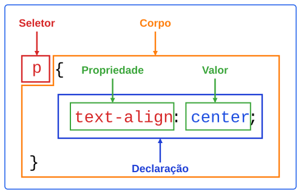

# Fundamentos de Programação Front-end

Este texto reúne o conteúdo de referência da disciplina de **Programação Front-end**. Apresenta a arquitetura básica da Web, o protocolo HTTP e a evolução do HTML. Em seguida, aborda o desenvolvimento de páginas web estruturadas com **HTML5**, a estilização com **CSS**, e os fundamentos de **JavaScript**. Todo o conteúdo prático é baseado na construção progressiva do projeto de exemplo **[SGCM (Sistema de Gerenciamento de Clínica Médica)](https://github.com/webacademyufac/sgcmdocs)**.

## Introdução

Um aspecto essencial, além de conhecer os termos e tecnologias fundamentais do desenvolvimento web, é compreender por que o desenvolvimento web se tornou o padrão de mercado, em contraste com o desenvolvimento desktop tradicional. As tecnologias relacionadas ao desenvolvimento web evoluíram ao longo dos anos para viabilizar uma plataforma universal, acessível via navegador, sem a necessidade de instalação em cada máquina.

Ainda que o desenvolvimento para dispositivos móveis, por exemplo, seja uma área em evidência, é importante entender que essa tendência está fortemente conectada ao desenvolvimento web. Tecnologias web tornaram-se a base tecnológica que sustenta tanto aplicações desktop quanto para dispositivos móveis.

### Diferença entre front-end e back-end

Inicialmente, é importante compreender a distinção entre Front-end e Back-end, pois trata-se de um padrão de organização de aplicações web amplamente adotado.

O **Front-end** é o que os usuários veem e com o que interagem diretamente. Por isso, quando falamos em front-end, o foco está na construção de uma interface visual e na experiência do usuário com a aplicação.

O **Back-end**, por sua vez, é o que gerencia o banco de dados, a lógica de negócios, a autenticação, entre outros recursos. Assim, no back-end o foco é o processamento e gestão de dados.

O Front-End e o Back-End se comunicam para fornecer uma experiência completa ao usuário. Podem estar integrados de forma direta na mesma aplicação, ou podem ser aplicações independentes que utilizam um meio externo para comunicação.

Para o usuário, Front-End e Back-End parecem ser uma única aplicação integrada, mas do ponto de vista da arquitetura da aplicação, podemos identificar papéis distintos. Considere o exemplo abaixo:



Esse fluxo de dados pode ser descrito nos seguintes passos:

1. **Usuário preenche um formulário** (Front-End) e clica em "Enviar".
2. **Front-End coleta os dados** do formulário e os envia para o Back-End.
3. **Back-End processa os dados**, verifica se o e-mail já existe no banco de dados, e se está tudo válido, armazena as informações.
4. **Back-End retorna uma confirmação** para o Front-End.
5. **Front-End exibe uma mensagem de sucesso** na tela do usuário.

É importante notar no exemplo que ao front-end coube a responsabilidade de coletar os dados do usuário e exibir a mensagem quando a operação foi concluída. Já o back-end funcionou como uma interface com o banco de dados.

Esse fluxo de dados acontece em frações de segundo, criando a experiência fluida que os usuários esperam. A integração entre essas duas partes é a base de funcionamento de qualquer aplicação web.

Embora tenham responsabilidades distintas, algumas tarefas podem ser compartilhadas entre os dois. Um exemplo deste tipo de tarefa é a validação de dados, que pode ocorrer tanto no Front-End (para melhorar a experiência do usuário) quanto no Back-End (para garantir segurança e integridade dos dados). Compreender essa distinção e essa integração é fundamental para entender como o desenvolvimento web funciona.

### O protocolo HTTP, HTML e a Web

Na década de 1980 a Internet era um conjunto de redes interconectadas usado principalmente por universidades, centros de pesquisa e instituições governamentais. O acesso era baseado sobretudo no protocolo TCP/IP, por meio de terminais e linhas de comando, a serviços como e‑mail, FTP, Telnet, Usenet, Gopher, entre outros. A largura de banda era baixa e o acesso comercial e doméstico ainda era raro. A navegação visual pelo conteúdo da rede ainda não era algo difundido, por isso a interação concentrava‑se na troca de arquivos, mensagens e no uso de ferramentas textuais.

> [!TIP]
> Gopher foi um protocolo de distribuição de documentos que oferecia navegação textual simples e eficiente para recuperar arquivos e informações em servidores remotos. É possível simular seu funcionamento no endereço <https://gopher.floodgap.com/overbite/>. Para isso, procure na página a extensão compatível com seu navegador e, após instalação, acesse o endereço `gopher://gopher.floodgap.com/`. O prefixo `gopher:` indica o protocolo usado para acessar o conteúdo, mas neste caso trata-se de uma simulação.

Neste contexto, [Tim Berners-Lee](https://pt.wikipedia.org/wiki/Tim_Berners-Lee), físico do [CERN](https://pt.wikipedia.org/wiki/Organiza%C3%A7%C3%A3o_Europeia_para_a_Investiga%C3%A7%C3%A3o_Nuclear) (Organização Europeia para a Pesquisa Nuclear), iniciou o desenvolvimento do projeto *Enquire*, cujo objetivo era interligar informações acadêmicas e científicas. Para isso, foi proposto um novo formato de organização de texto, o **hipertexto**, que relaciona textos, imagens, sons e vários outros tipos de conteúdo multimídia.

Para alcançar o principal objetivo do projeto, o de permitir a troca destes conteúdos usando o novo formato, o hipertexto deveria trafegar através da infraestrutura de redes TCP/IP. Assim, foi necessário desenvolver três componentes essenciais:

1. **HTTP (Hypertext Transfer Protocol)**: O protocolo de comunicação padrão para transferência dos dados entre o cliente (navegador) e o servidor.
2. **HTML (Hypertext Markup Language)**: A linguagem de marcação projetada para estruturar e descrever o conteúdo baseado em hipertexto.
3. **WWW (World Wide Web)**: O sistema de documentos e recursos interligados por hiperlinks. Reúne servidores, navegadores, formatos (como HTML), protocolos (como HTTP) e práticas de publicação para tornar a informação navegável e acessível em escala global. É um serviço construído sobre a infraestrutura da Internet, e não a própria infraestrutura.

A Web funciona sobre uma **arquitetura cliente-servidor**. Isto significa que quando você digita uma URL no navegador, este envia uma **requisição HTTP** ao servidor, solicitando um recurso (página HTML, imagem, etc.). O servidor processa a requisição e retorna uma **resposta HTTP** contendo o conteúdo solicitado, tipicamente um documento HTML. O navegador então recebe esse HTML e o **renderiza** (processa e exibe visualmente), construindo a árvore DOM e aplicando estilos CSS para apresentar a página ao usuário. Este fluxo simples, baseado em requisições e respostas, é a base de funcionamento da Web como a conhecemos.



O primeiro site da história foi criado em 1991 e hospedado no CERN, podendo ser encontrado em <https://info.cern.ch/>. Na época ainda não havia navegadores gráficos como conhecemos hoje. Os primeiros navegadores foram surgindo e evoluindo simultaneamente com o próprio HTML, acompanhando a evolução da linguagem. Essa co-evolução entre linguagem e ferramenta de visualização foi fundamental para a consolidação da Web como plataforma de comunicação global.

> [!TIP]
> Conhece o [Wayback Machine](https://web.archive.org/)? É um serviço do Internet Archive que armazena cópias históricas de páginas web desde 1996. Através dele é possível visualizar como sites eram no passado, observando na prática a evolução das tecnologias e do design web ao longo dos anos.

### Evolução do HTML

Após seu lançamento, o HTML evoluiu através de várias versões, cada uma refletindo os desafios de padronização, compatibilidade entre navegadores e as novas necessidades do desenvolvimento web.

* **1990**: HTML Versão 1.
* **1995**: HTML Versão 2, cujo desenvolvimento se deu em colaboração com várias empresas, incluindo fabricantes de navegadores, mas marcado pela falta de padrões de implementação.
* **1995**: HTML Versão 3, lançado sob a responsabilidade do recém-criado **[W3C (World Wide Web Consortium)](https://www.w3.org)**, estabelecendo as primeiras padronizações oficiais.
* **1997**: HTML Versão 4, que se tornou muito popular e foi bastante utilizada por anos.
* **2004**: O W3C propõe substituir o HTML por uma linguagem baseada na tecnologia XML, surgindo assim o **XHTML versão 1**.

Até 2004, o HTML 4 havia representado um marco de estabilidade. No entanto, a tentativa de transição para XHTML mostrou-se desalinhada das necessidades do mercado, que demandava compatibilidade com código legado e suporte a novas funcionalidades para aplicações web.

Contrários à decisão do W3C, os fabricantes dos navegadores Firefox, Opera e Safari criaram o **[WHATWG](https://whatwg.org/)** (*Web Hypertext Application Technology Working Group*) para continuar o desenvolvimento do HTML. A W3C ainda lançou, em 2007, o XHTML 2.0, mas o WHATWG já tinha uma proposta de nova versão do HTML, o que fez posteriormente o W3C desistir do XHTML. Assim, tem início em 2008 o projeto do HTML 5 com o apoio da W3C. A nova versão trazia pela primeira vez a separação total entre semântica, estilo e interatividade, por meio de mudanças como a remoção de atributos de estilo dos elementos.

A partir do HTML5, a linguagem deixou de seguir o modelo tradicional de versões numeradas e passou a ser mantida como um padrão atualizado continuamente pelo WHATWG (*HTML Living Standard*). Isso significa que não existe um "HTML6" ou versões futuras planejadas, pois a especificação é um documento único e em constante evolução, onde novas funcionalidades são incorporadas, revisadas e corrigidas de forma incremental à medida que surgem necessidades e consenso entre os fabricantes de navegadores. Esse modelo foi adotado porque, na prática, os navegadores sempre acompanharam a versão mais recente da especificação, e não as versões numeradas que rapidamente se tornavam obsoletas. Assim, o termo "HTML5" se refere ao HTML moderno como um todo, e não a uma versão específica.

> [!NOTE]
> O HTML Living Standard é uma **especificação**, ou seja, um documento que define como a linguagem deve funcionar. Cabe aos fabricantes de navegadores implementar e dar suporte às funcionalidades descritas nessa especificação. Esse processo não acontece de forma simultânea, pois cada navegador possui seu próprio ciclo de desenvolvimento, o que significa que uma nova funcionalidade pode estar disponível no Chrome, mas ainda não no Safari ou Firefox, por exemplo. Serviços como o [Can I Use](https://caniuse.com/) ou a tabela de compatibilidade na documentação do [MDN Web Docs](https://developer.mozilla.org/), permitem verificar o suporte entre os diferentes navegadores.

### Tecnologias Front-end

O desenvolvimento front-end moderno é sustentado por três tecnologias complementares, cada uma com uma responsabilidade bem definida, que trabalham de forma integrada nos navegadores web. Como mencionado anteriormente, a separação entre estrutura, apresentação e comportamento foi um marco do HTML5, e é exatamente essa divisão que define as três tecnologias fundamentais do front-end.

* **HTML**: Responsável pela **estruturação e semântica** do conteúdo. Define o que cada elemento da página representa, como títulos, parágrafos, imagens, links e formulários. O HTML não se preocupa com aparência nem com comportamento; seu papel é organizar a informação de forma hierárquica e significativa, permitindo que navegadores, leitores de tela e motores de busca compreendam o conteúdo.

* **CSS**: Responsável pela **apresentação e layout** visual. Controla como os elementos estruturados pelo HTML são exibidos na tela, incluindo cores, fontes, espaçamentos, posicionamento, alinhamento e adaptação a diferentes tamanhos de dispositivo. A separação entre HTML e CSS permite alterar completamente a aparência de uma página sem modificar sua estrutura.

* **JavaScript**: Responsável pelo **comportamento e interatividade** da página. Permite responder a ações do usuário (cliques, digitação, movimentos do mouse), manipular elementos da página dinamicamente, realizar validações, comunicar-se com servidores em segundo plano e criar experiências ricas sem necessidade de recarregar a página.

Essas três tecnologias operam de forma complementar e independente. O HTML fornece a base estrutural, o CSS aplica a camada visual sobre essa estrutura, e o JavaScript adiciona a lógica de interação. Essa separação de responsabilidades é um princípio fundamental do desenvolvimento front-end moderno.

Essa separação trouxe benefícios práticos importantes. O exemplo mais evidente é a divisão entre semântica e estilo, onde alterar a aparência de um site inteiro exige mudanças apenas no CSS, sem tocar no HTML de cada página. Além disso, as páginas ficam mais leves ao evitar repetição de código, a acessibilidade é favorecida por um HTML semântico que pode ser interpretado por leitores de tela independentemente do estilo, e a compatibilidade com diferentes dispositivos se torna possível ao aplicar estilos alternativos sobre o mesmo conteúdo. Além de outros benefícios que essa abordagem proporciona.

### Padrões Web e Acessibilidade

Os padrões web (*web standards*) são amplamente discutidos e empregados por desenvolvedores e pessoas envolvidas com o desenvolvimento de aplicações para web. São recomendações (e não normas) destinadas a orientar os desenvolvedores para o uso de boas práticas de construção de páginas web que tornam o conteúdo acessível para todos.

Apesar de existirem órgãos normatizadores, como o ISO Standards e ECMA, normalmente quando discutimos padrões web nos referimos aos padrões do W3C. Uma recomendação do W3C é uma especificação ou um conjunto de diretrizes que passou por discussão e se estabeleceu um consenso, passando a ser indicado seu amplo emprego.

Esse consenso em torno dos padrões web, formado pela indústria e pelas comunidades de desenvolvedores, se sustenta nos benefícios práticos que eles trazem. Entre os principais, estão os seguintes.

* **Melhor indexação pelos mecanismos de busca**: um HTML semântico e bem estruturado ajuda buscadores como o Google a entenderem o conteúdo da página. Por exemplo, ao identificar corretamente o título principal e os cabeçalhos das seções, o buscador consegue avaliar melhor o assunto da página e exibi-la para as pesquisas certas.

* **Renderização mais rápida**: um documento HTML correto tende a ser menor, pois usa os elementos certos em vez de acumular elementos desnecessários, e por isso é interpretado e renderizado mais rápido pelo navegador. Por exemplo, uma lista de itens construída com os os elementos `<ul>` e `<li>` gera um código mais enxuto, enquanto que a mesma lista montada com vários elementos `<div>` ou `<span>`, aninhados e estilizados de forma a parecer com uma lista, produz um documento maior. Além disso, separar o CSS em arquivo próprio permite que o navegador reaproveite esse arquivo em outras páginas do site, acelerando o carregamento.

* **Garantia de funcionamento completo da página**: seguir as especificações reduz o risco de recursos quebrarem em determinados ambientes. Por exemplo, um formulário construído com os elementos corretos continua funcionando mesmo que o JavaScript falhe ou esteja desativado, pois a estrutura básica já é válida e pode funcionar por conta própria.

* **Páginas com melhor aspecto de apresentação**: com a apresentação concentrada no CSS, é possível aplicar um visual consistente em todo o site e ajustá-lo com facilidade. Por exemplo, mudar a cor principal ou a fonte de todas as páginas exige alterar apenas o arquivo global de estilo, mantendo a aparência uniforme.

* **Comportamento uniforme entre diferentes navegadores de internet**: quando todos os navegadores seguem as mesmas especificações, a página tende a se comportar da mesma forma em cada um deles. Por exemplo, uma página feita conforme os padrões funciona de maneira semelhante no Chrome, no Firefox e no Safari, evitando inconsistências para quem usa navegadores diferentes. Nem sempre foi assim, pois durante a chamada [guerra dos navegadores](https://hackernoon.com/lang/pt/how-the-browser-wars-changed-the-landscape-of-the-internet) cada um tentava impor seus próprios padrões. Essa tentativa teve impacto maior com a Microsoft, no período em que o Internet Explorer dominou o mercado (chegando a cerca de 95% com o IE6, por volta de 2001), onde foram criados muitos padrões próprios. Isso obrigava os desenvolvedores a escrever código alternativo dependendo do navegador para que o site funcionasse em todos. Um exemplo disso eram os comentários condicionais do Internet Explorer, escritos no formato `<!--[if IE]>`, que entregavam código exclusivo para esse navegador enquanto os demais os tratavam como um comentário comum e os ignoravam. A popularização dos padrões web ajudou a resolver esse problema, permitindo escrever um único código que funciona de forma consistente em qualquer navegador.

#### Acessibilidade na Web

Acessibilidade na web significa permitir que o maior número possível de pessoas possa usar a web, independentemente de suas limitações. Restrições no acesso à web é um problema que afeta muitas pessoas que possuem algum tipo de necessidade especial. Ainda existem muitas páginas que possuem barreiras de acessibilidade que dificultam ou mesmo tornam impossível o acesso. Veja abaixo algumas das barreiras mais comuns ao acessar o conteúdo.

* Imagens que não possuem texto alternativo.
* Formulários que não podem ser navegados em uma sequência lógica ou que não estão rotulados.
* Páginas com tamanhos de fonte absolutos, que não podem ser aumentados ou reduzidos facilmente.
* Páginas que, devido ao layout inconsistente, são difíceis de navegar quando ampliadas por causa da perda do conteúdo adjacente.
* Textos apresentados como imagens, que não quebram as linhas quando ampliados.

Os padrões web representam o básico para uma página web acessível. Escrever código válido e semanticamente correto faz com que o conteúdo tenha significado claro, e é justamente esse significado que as tecnologias assistivas, como os leitores de tela, utilizam para interpretar a página. Dessa forma, muitas das barreiras citadas acima são superadas com a simples adoção dos padrões.

Ainda assim, os padrões web sozinhos não cobrem todas as necessidades de acessibilidade. Por isso, é importante acrescentar a eles as técnicas associadas ao WCAG e suas recomendações. As Diretrizes de Acessibilidade para Conteúdo Web (WCAG) abrangem um vasto conjunto de recomendações que têm como objetivo tornar o conteúdo web mais acessível. Enquanto os padrões web garantem a base estrutural, o WCAG vai além e trata da experiência de uso por pessoas com diferentes limitações. As diretrizes acrescentam orientações que a estrutura sozinha não resolve, como garantir contraste de cor suficiente entre texto e fundo, entre outros.

### Design Responsivo

O **design responsivo** é a abordagem que permite a uma página web oferecer um **conteúdo acessível** e uma **boa experiência de uso** em qualquer dispositivo, respeitando as limitações de cada um. Na prática, é o que faz um site se ajustar bem tanto na tela pequena de um celular quanto na tela grande de um computador.

Não se trata de criar uma versão para cada tipo de dispositivo. Em vez de manter, por exemplo, um site separado para celulares e outro para computadores, o design responsivo parte de uma única base que se adapta ao espaço disponível na tela. Essa adaptação acontece de forma automática, à medida que a página identifica o espaço disponível e reorganiza seus elementos para aproveitá-lo da melhor maneira. Assim, o mesmo conteúdo é exibido de forma correta tanto em uma tela pequena quanto em uma grande, sem duplicar o trabalho de desenvolvimento e manutenção.

Vale destacar que seguir os padrões web já ajuda bastante a deixar uma página responsiva. A separação entre semântica e estilo, por exemplo, contribui diretamente com esse trabalho, já que boa parte da responsividade é implementada por meio das regras de estilo do CSS. Com o conteúdo separado da aparência, fica muito mais fácil ajustar o layout para cada tamanho de tela, pois basta alterar o CSS sem precisar mexer na estrutura da página.

Além dos padrões web, os próprios navegadores oferecem ferramentas que apoiam esse processo, como o Chrome DevTools, que permite simular diferentes tamanhos de tela e dispositivos sem precisar de aparelhos físicos para cada teste. Essas ferramentas também permitem inspecionar a estrutura do documento e identificar problemas, o que ajuda tanto a manter o código dentro dos padrões web quanto a garantir que a página realmente se adapte de forma responsiva.

## HTML

O **HTML (Hypertext Markup Language)** é a linguagem de marcação responsável por definir a **estrutura** e o **significado** do conteúdo de uma página web. É com ele que indicamos ao navegador o que cada parte da página representa, como títulos, parágrafos, imagens, links, listas e formulários. Diferente de uma linguagem de programação, o HTML não executa lógica, uma vez que seu papel é organizar e descrever o conteúdo, servindo de base para o CSS (apresentação) e o JavaScript (comportamento).

### Introdução ao HTML

Um documento HTML é composto por elementos **hierarquicamente organizados**, onde cada elemento pode conter outros elementos, formando uma estrutura de aninhamento a partir do elemento raiz (`<html>`). Essa relação entre elementos mais externos e mais internos é o que estabelece a hierarquia do documento, comumente representada como uma árvore.

Tomando como base a estrutura básica de uma página, a hierarquia entre os elementos pode ser representada da seguinte forma:



Nesse exemplo, `<html>` é o elemento mais externo (que envolve todos os demais), e dentro dele estão `<head>` e `<body>`, no mesmo nível. Seguindo para dentro, os elementos contidos na `<div>` (como o `<h1>`) estão mais internos, aninhados dentro dela, que por sua vez está dentro de `<body>` e de `<html>`.

Compreender essa hierarquia é essencial não apenas para entender como o HTML funciona, mas também porque ela está diretamente relacionada à outras duas tecnologias fundamentais do desenvolvimento web. **No CSS**, o conceito de **herança** está diretamente ligado à hierarquia, pois determinadas propriedades aplicadas a um elemento pai são propagadas automaticamente para seus elementos filhos. Além disso, a própria escrita de seletores (como seletores de descendência) e a resolução de conflitos na cascata dependem da posição de cada elemento nessa árvore. **No JavaScript**, a manipulação do **DOM (Document Object Model)** também é regida por essa hierarquia. O navegador transforma o documento HTML em uma árvore de objetos, e é navegando por essa árvore (acessando pais, filhos e irmãos) que o código localiza, cria, altera e remove elementos dinamicamente.

Por isso, a hierarquia dos elementos é um conceito transversal, e dominá-la desde o HTML facilita o entendimento sobre muitos outros aspectos do desenvolvimento web.

### Elementos e Tags

Para inserir um elemento em um documento HTML, utilizamos tags correspondentes a esse elemento. As tags são definidas usando a sintaxe `<nomedatag>`. Inicialmente, é importante distinguir três termos que costumam ser confundidos. A **tag** é o marcador em si, como `<p>`. O **elemento** é a unidade completa, formada pela tag de abertura, pelo conteúdo e pela tag de fechamento. O **conteúdo** é aquilo que fica entre a abertura e o fechamento, podendo ser texto ou outros elementos aninhados. Assim, `<p>` é uma tag, enquanto `<p>Olá, mundo!</p>` é um elemento cujo conteúdo é o texto "Olá, mundo!".

O diagrama a seguir aponta as partes que compõem o elemento:

```html
<p> ... </p>
 |   |    |
 |   |    +--> tag de fechamento
 |   +-------> conteúdo
 +-----------> tag de abertura
```

**Exemplos de tags:**

* `<html></html>`: Elemento raiz que envolve todo o conteúdo da página.
* `<head></head>`: Cabeçalho do documento, contendo metadados, links para estilos e scripts, e o título da página.
* `<meta>`: Elemento que define metadados, como o conjunto de caracteres da página.
* `<script></script>`: Elemento que permite incluir código JavaScript no documento.
* `<title></title>`: Define o título da página exibido na aba do navegador.
* `<body></body>`: Corpo do documento, contendo todo o conteúdo visível da página.
* `<h1></h1>`: Define o título principal da página.
* `<p></p>`: Define um parágrafo de texto.
* `<a></a>`: Define um link para outro documento ou recurso.
* ``: Define uma imagem.
* `<table></table>`: Define uma tabela.
* `<br>`: Define uma quebra de linha.

A estrutura básica da marcação de elementos HTML pode seguir dois modelos sintáticos principais:

1. **Elementos normais**: Possuem uma tag de abertura, conteúdo interno e uma tag de fechamento correspondente.

   ```html
   <h1>WEB ACADEMY</h1>
   ```

2. **Elementos vazios**: Não contêm conteúdo interno ou fechamento separado. São autocontidos e declaram apenas atributos.

   ```html
   
   ```

Os elementos podem ser configurados por meio de **atributos**, que fornecem informações adicionais ou modificam seu comportamento e identificação. Os atributos são declarados na tag de abertura, no formato `nome="valor"`, e um mesmo elemento pode ter vários atributos separados por espaço.

```html
<a href="contato.html" target="_blank">Fale conosco</a>
```

No exemplo, `href` e `target` são atributos do elemento `<a>`. Existem também os **atributos booleanos**, cuja simples presença já ativa um comportamento, dispensando um valor, como `required` e `disabled` em campos de formulário.

```html
<input type="text" required>
```

> [!TIP]
> O HTML possui uma grande quantidade de elementos, cada um com sua finalidade. A lista completa e atualizada, com a descrição de cada elemento e seus atributos, está disponível na [referência de elementos HTML do MDN Web Docs](https://developer.mozilla.org/pt-BR/docs/Web/HTML/Element).

### Estrutura de uma Página HTML

Todo documento HTML segue uma estrutura básica padronizada, composta por um conjunto de elementos essenciais organizados de forma hierárquica. Essa estrutura define a base sobre a qual todo o conteúdo da página é construído e é esperada pelo navegador para que o documento seja interpretado corretamente. O exemplo abaixo é o ponto de partida da página `profissionais.html`, que será construída ao longo das próximas seções, e apresenta essa estrutura mínima.

```html
<!DOCTYPE html>
<html lang="pt-br">
    <head>
        <meta charset="utf-8">
        <title>SGCM - Profissionais</title>
        <link rel="icon" href="favicon.ico" type="image/x-icon">
    </head>
    <body>
        <p>Conteúdo</p>
    </body>
</html>
```

* **`<!DOCTYPE html>`**: Instrução inicial obrigatória que informa ao navegador que o documento deve ser interpretado segundo a especificação do HTML5.
* **`<html lang="pt-br">`**: Elemento mais externo, que envolve todo o documento. O atributo `lang` declara o idioma principal do conteúdo. Sua definição é importante para a acessibilidade, pois orienta leitores de tela a usar a pronúncia correta, e também para os mecanismos de busca e para recursos de tradução automática dos navegadores.
* **`<head>`**: Cabeçalho do documento. Reúne informações sobre a página que não são exibidas diretamente no conteúdo, como metadados, o título e ligações para arquivos externos.
* **`<meta charset="utf-8">`**: Declara a **codificação de caracteres** utilizada no documento. O valor `utf-8` corresponde a uma codificação do padrão Unicode, capaz de representar os caracteres de praticamente todos os idiomas. Informar a codificação corretamente é o que garante que acentos e caracteres especiais sejam exibidos como esperado, evitando que apareçam símbolos incorretos no lugar. Existem outras codificações (como a ISO-8859-1), mas o UTF-8 é o padrão recomendado e amplamente adotado na web.
* **`<title>`**: Define o título que será exibido na aba ou na barra de títulos do navegador.
* **`<link>`**: Estabelece uma ligação com um recurso externo. O atributo `rel` (de *relationship*) indica o tipo de relação entre a página e esse recurso, como `icon` para o ícone da aba ou `stylesheet` para uma folha de estilo. No exemplo, `rel="icon"` associa o favicon exibido na aba do navegador, mas o `<link>` também é comumente usado para vincular folhas de estilo CSS, com `rel="stylesheet"`.
* **`<body>`**: Corpo do documento. Contém toda a parte visualizável que será renderizada na tela.

> [!NOTE]
> É comum confundir os termos **conjunto de caracteres** e **codificação**. O conjunto de caracteres é o repertório de símbolos disponíveis, onde cada caractere recebe um número identificador (o Unicode, por exemplo, define que a letra "á" tem o identificador U+00E1). A codificação, por sua vez, define como esses identificadores são convertidos em bytes para armazenamento e transmissão. O UTF-8 é uma codificação do Unicode. Embora o atributo se chame `charset`, o valor que se declara nele (`utf-8`, `iso-8859-1`, entre outros) é, na prática, uma codificação de caracteres.

### Estrutura e Layout

O HTML5 introduziu elementos semânticos para organizar a estrutura interna do layout de uma página web, substituindo o uso excessivo de elementos genéricos ou de tabelas para fins de layout. Essas tags semânticas ajudam a definir claramente o papel de cada seção da página, melhorando a acessibilidade e a compreensão do conteúdo por parte de navegadores e tecnologias assistivas.

Os principais elementos semânticos de estrutura são:

* **`<header>`**: Cabeçalho de uma página ou seção, normalmente reunindo logo, título e informações de topo.
* **`<nav>`**: Bloco de navegação, que agrupa os principais links ou o menu do site.
* **`<main>`**: Conteúdo principal e único da página, aquele que a diferencia das demais.
* **`<aside>`**: Conteúdo lateral e complementar ao principal, como avisos, atalhos ou informações relacionadas.
* **`<footer>`**: Rodapé de uma página ou seção, geralmente com dados institucionais, contato e créditos.
* **`<section>`**: Seção temática do conteúdo, agrupando um conjunto de informações relacionadas.
* **`<article>`**: Conteúdo autônomo, que faz sentido de forma independente, como uma notícia ou um card.

No exemplo abaixo, o `<header>` ocupa o topo, seguido pelo `<nav>`; na faixa central, o `<main>` divide o espaço com o `<aside>`; e o `<footer>` fecha a base.



No `<body>` da página `profissionais.html`, as grandes regiões do layout são definidas primeiro com os elementos semânticos.

```html
<body>
    <header>
    </header>
    <nav>
    </nav>
    <main>
    </main>
    <footer>
    </footer>
</body>
```

### Elementos Genéricos

Quando não há um elemento semântico adequado para classificar um fragmento de conteúdo, é possível utilizar elementos genéricos. São elementos que não representam nenhum conteúdo específico, mas são úteis para agrupar conteúdos (ou outros elementos) que compartilham atributos de estilo. Esse é o caso dos elementos `<div>` e `<span>`.

* **`<div>`**: Elemento de **nível de bloco (block-level)**, que ocupa toda a largura horizontal disponível e inicia em uma nova linha. É usado para criar seções e aplicar layouts estruturais.
* **`<span>`**: Elemento de **nível de linha (inline-level)**, que ocupa apenas o espaço exato delimitado por seu texto ou conteúdo, sem forçar quebras de linha. Usado para delimitar partes específicas de um texto.

No `<header>` de `profissionais.html`, o cabeçalho é organizado em duas `<div>`, onde a `<div id="logo">` agrupa o nome do sistema (em um `<span>`), e a `<div id="usuarioInfo">` reúne os dados do usuário autenticado.

```html
<header>
    <div id="logo">
        <span>SGCM</span>
    </div>
    <div id="usuarioInfo">
        <span>Usuário: Administrador (admin)</span>
        <span>Papel: ADMIN</span>
    </div>
</header>
```

Já o `<footer>` usa `<span>` para separar cada informação institucional, como o nome do sistema e o contato de suporte.

```html
<footer>
    <span>SGCM - Sistema de Gerenciamento de Clínica Médica</span>
    <span>Suporte técnico: (68) 5555-5555</span>
</footer>
```

### Imagens

Imagens são inseridas com a tag ``, que é uma tag vazia, ou seja, não possui conteúdo nem tag de fechamento. O atributo `src` indica o caminho do arquivo da imagem a ser exibida, e o atributo `alt` fornece um texto alternativo que descreve o conteúdo da imagem. Esse texto alternativo é fundamental para a acessibilidade, pois é lido pelos leitores de tela e exibido caso a imagem não possa ser carregada, além de ajudar os mecanismos de busca a entender a imagem.

A partir do HTML5, tornou-se possível associar semanticamente uma imagem à sua legenda por meio das tags `<figure>`, que agrupa a imagem e sua legenda, e `<figcaption>`, que define o texto da legenda.

```html
<figure>
    
    <figcaption>
        Legenda da foto.
    </figcaption>    
</figure>
```

Na página `profissionais.html`, a imagem do logo é inserida dentro da `<div id="logo">` do cabeçalho.

```html
<div id="logo">
    
    <span>SGCM</span>
</div>
```

### Links

Os links, ou hiperlinks, são o que conecta as páginas entre si e dá origem ao conceito de hipertexto, permitindo navegar de um documento para outro com um clique. Um link é declarado com a tag `<a>` (âncora), e seu destino é definido pelo atributo `href`. Esse destino pode ser outra página, um endereço na web, um ponto dentro da própria página ou até um recurso externo, como um endereço de email.

O conteúdo clicável do link fica entre a abertura e o fechamento da tag `<a>`, e pode ser tanto um texto simples quanto outros elementos HTML, como imagens, títulos ou blocos inteiros.

```html
<a href="http://webacademy.ufac.br">
    WEB ACADEMY
</a>

<a href="http://webacademy.ufac.br">
    <figure>
        
        <figcaption>
            WEB ACADEMY
        </figcaption>
    </figure>
</a>
```

A seguir estão alguns outros usos comuns do atributo `href`.

* **Link interno/relativo**: `<a href="profissionais.html">Profissionais</a>`
* **Âncora interna**: `<a href="#rodape">Ir para o rodapé</a>` (leva a um elemento da própria página cujo `id` seja `rodape`).
* **Protocolo de email**: `<a href="mailto:suporte.sgcm@ufac.br">suporte.sgcm@ufac.br</a>`
* **Botão/Link inativo**: `<a href="javascript:void(0)">Logout</a>`. O valor `javascript:void(0)` executa uma expressão JavaScript que não retorna nada, anulando a navegação padrão do `<a>`. Assim o link não muda de página e serve apenas como gatilho para ser interceptado por código JavaScript.

Na página `profissionais.html`, o link de logout é adicionado na `<div id="usuarioInfo">` do cabeçalho:

```html
<header>
    <div id="logo">
        
        <span>SGCM</span>
    </div>
    <div id="usuarioInfo">
        <span>Usuário: Administrador (admin)</span>
        <span>Papel: ADMIN</span>
        <a href="javascript:void(0)">
            Logout
        </a>
    </div>
</header>
```

No rodapé, o email de suporte é transformado em link com o protocolo `mailto`:

```html
<footer>
    <span>SGCM - Sistema de Gerenciamento de Clínica Médica</span>
    <span>Suporte técnico: (68) 5555-5555 | <a href="mailto:suporte.sgcm@ufac.br">suporte.sgcm@ufac.br</a></span>
</footer>
```

### Listas

As listas organizam conjuntos de itens relacionados, como menus de navegação, sequências de passos ou qualquer agrupamento de dados. O HTML oferece dois tipos principais de lista, que se diferenciam pela importância da ordem dos itens. Quando a sequência é relevante, como em um passo a passo, usa-se a lista ordenada. Quando os itens não têm uma ordem específica, como nos links de um menu, usa-se a lista não ordenada.

Os elementos que compõem as listas são apresentados a seguir.

* **Lista Não Ordenada (`<ul>`)**: Itens marcados por símbolos (bullets), ideal para menus de navegação.
* **Lista Ordenada (`<ol>`)**: Itens numerados ou sequenciados alfabeticamente.
* **Itens de Lista (`<li>`)**: Elemento obrigatório para cada entrada dentro de um `<ul>` ou `<ol>`.

No `<nav>` de `profissionais.html`, o menu de navegação é montado como uma lista não ordenada.

```html
<nav>
    <ul>
        <li><a href="agenda.html">Agenda</a></li>
        <li><a href="atendimento.html">Atendimento</a></li>
        <li><a href="pacientes.html">Pacientes</a></li>
        <li><a href="profissionais.html">Profissionais</a></li>
        <li><a href="unidades.html">Unidades</a></li>
        <li><a href="especialidades.html">Especialidades</a></li>
        <li><a href="convenios.html">Convênios</a></li>
        <li><a href="usuarios.html">Usuários</a></li>
    </ul>
</nav>
```

### Tabelas

Diferente de outros elementos HTML, uma tabela é definida por um conjunto de tags diferentes. Dentre elas, três são essenciais para a construção de qualquer tabela: `<table>`, `<tr>` e `<td>`.

A figura abaixo mostra o aninhamento das tags de uma tabela: o `<table>` envolve todas as linhas `<tr>`, e cada `<tr>` envolve as células `<td>` daquela linha.



O objetivo de uma tabela é **apresentar dados tabulares**, comparativos, estatísticos ou de qualquer outra natureza que se beneficie de uma organização em linhas e colunas. Por isso, o uso de tabelas para fins de layout é desencorajado, pois não é a finalidade desse elemento.

> [!NOTE]
> Antes da popularização do CSS, era comum usar tabelas para controlar o layout das páginas, aninhando `<table>` dentro de `<table>` e recorrendo a truques como imagens transparentes de 1 pixel para forçar espaçamentos. Em reação a essa prática surgiu, ainda no início dos anos 2000, o movimento [Tableless](https://pt.wikipedia.org/wiki/Tableless), que defendia o uso de tabelas apenas para dados tabulares e do CSS para o layout, separando o conteúdo da apresentação. Essa mesma filosofia de padrões web e semântica é a que, mais tarde, motivou os elementos semânticos introduzidos pelo HTML5 (como `<header>`, `<nav>`, `<main>` e `<footer>`), que passaram a estruturar o layout sem depender de tabelas.

Algumas tags adicionais são usadas para organizar o conteúdo da tabela, o que ajuda a enriquecer a semântica e a acessibilidade da página.

* **`<thead>`**: Cabeçalho, contendo linhas estruturadas de títulos (`<th>`).
* **`<tbody>`**: Corpo principal da tabela, contendo linhas de dados (`<tr>` e `<td>`).
* **`<tfoot>`**: Rodapé da tabela, geralmente usado para informações resumidas.

Além dessas divisões, outros elementos complementam a construção de tabelas, como `<caption>`, `<colgroup>` e `<col>`.

* **`<caption>`**: Legenda ou título da tabela, declarada logo após a abertura do `<table>`.
* **`<colgroup>`**: Agrupa uma ou mais colunas da tabela, permitindo aplicar definições comuns a elas.
* **`<col>`**: Representa uma coluna dentro de um `<colgroup>`, servindo de referência para estilos ou atributos aplicados àquela coluna.

Abaixo, a implementação da tabela de profissionais em `profissionais.html`.

```html
<table>
    <thead>
        <tr>
            <th>ID</th>
            <th>Nome</th>
            <th>Registro</th>
            <th>Especialidade</th>
            <th>Unidade</th>
            <th>Telefone</th>
            <th>E-mail</th>
            <th>Ações</th>
        </tr>
    </thead>
    <tbody>
        <tr>
            <td>1</td>
            <td></td>
            <td></td>
            <td></td>
            <td></td>
            <td></td>
            <td></td>
            <td>
                <a href="javascript:void(0)">Editar</a>
                <a href="javascript:void(0)">Excluir</a>
            </td>
        </tr>
        <tr>
            <td>2</td>
            <td></td>
            <td></td>
            <td></td>
            <td></td>
            <td></td>
            <td></td>
            <td>
                <a href="javascript:void(0)">Editar</a>
                <a href="javascript:void(0)">Excluir</a>
            </td>
        </tr>
        <tr>
            <td>3</td>
            <td></td>
            <td></td>
            <td></td>
            <td></td>
            <td></td>
            <td></td>
            <td>
                <a href="javascript:void(0)">Editar</a>
                <a href="javascript:void(0)">Excluir</a>
            </td>
        </tr>
        <tr>
            <td>4</td>
            <td></td>
            <td></td>
            <td></td>
            <td></td>
            <td></td>
            <td></td>
            <td>
                <a href="javascript:void(0)">Editar</a>
                <a href="javascript:void(0)">Excluir</a>
            </td>
        </tr>
        <tr>
            <td>5</td>
            <td></td>
            <td></td>
            <td></td>
            <td></td>
            <td></td>
            <td></td>
            <td>
                <a href="javascript:void(0)">Editar</a>
                <a href="javascript:void(0)">Excluir</a>
            </td>
        </tr>
    </tbody>
    <tfoot>
        <tr>
            <td colspan="8">Total de registros: 5</td>
        </tr>
    </tfoot>
    </table>
```

> [!NOTE]
> O atributo `colspan="8"` no rodapé instrui o navegador a mesclar as 8 colunas horizontais da tabela em uma única célula para exibição do texto.

### Formulários

Um formulário é o meio pelo qual uma página coleta informações do usuário e as envia para serem processadas. Essa é a base da interação em aplicações web, presente em telas de login, cadastros, buscas e filtros. O elemento `<form>` agrupa os campos e define, entre outras coisas, para onde os dados serão enviados (atributo `action`).

```html
<form action="/action_page.jsp">
    <label for="nome">Nome:</label>
    <input type="text"
           name="nome" id="nome"
           placeholder="Digite seu primeiro nome">
    <label for="sobrenome">Sobrenome:</label>
    <input type="text"
           name="sobrenome" id="sobrenome"
           placeholder="Digite seu sobrenome">
    <input type="submit" value="Enviar">
</form>
```

Dentro do formulário, cada campo é composto por um rótulo e por um controle de entrada. Os elementos mais comuns para montar esses campos são:

* **`<label>`**: Rótulo que identifica um campo. É associado ao controle pelo atributo `for`, que aponta para o `id` do campo correspondente. Essa associação melhora a acessibilidade e permite focar o campo ao clicar no texto do rótulo.
* **`<input>`**: Controle de entrada de dados. O atributo `name` identifica o campo, ou seja, é o nome sob o qual o valor será enviado, e o atributo `type` define o tipo do campo, determinando o formato de dado esperado e o comportamento do controle.
* **`<select>` / `<option>`**: Campo de seleção usado quando as opções são predefinidas. O `<select>` apresenta um menu suspenso, e cada alternativa é declarada por um `<option>`.

> [!TIP]
> O elemento `<input>` possui uma grande variedade de tipos, cada um com aparência e comportamento próprios. A lista completa está disponível na [referência de tipos de input do MDN Web Docs](https://developer.mozilla.org/en-US/docs/Web/HTML/Element/input#input_types).

Abaixo, a implementação de formulário da página `profissionais.html`.

```html
<form action="#">
    <label for="nome">Nome</label>
    <input type="text" name="nome" id="nome" required>

    <label for="registro">Registro</label>
    <input type="text" name="registro" id="registro" required>

    <label for="especialidade">Especialidade</label>
    <select name="especialidade" id="especialidade" required>
        <option value="">Selecione</option>
        <option value="1">Oncologia</option>
        <option value="2">Geriatria</option>
        <option value="3">Dermatologia</option>
        <option value="4">Cardiologia</option>
        <option value="5">Pediatria</option>
    </select>

    <label for="unidade">Unidade</label>
    <select name="unidade" id="unidade" required>
        <option value="">Selecione</option>
        <option value="1">Unidade A</option>
        <option value="2">Unidade B</option>
        <option value="3">Unidade C</option>
        <option value="4">Unidade D</option>
        <option value="5">Unidade E</option>
    </select>

    <label for="telefone">Telefone</label>
    <input type="text" name="telefone" id="telefone">

    <label for="email">E-mail</label>
    <input type="email" name="email" id="email">

    <input type="button" value="Cancelar">
    <input type="submit" value="Salvar">
</form>
```

## CSS

Depois de estruturar o conteúdo com HTML, o próximo passo é cuidar da sua aparência. Toda página tem duas preocupações distintas, o conteúdo e a forma como ele é apresentado, e misturar as duas torna o código difícil de manter. O CSS é a tecnologia responsável por essa apresentação, definindo cores, fontes, espaçamentos e todo o layout dos elementos, o que mantém o HTML focado apenas em descrever e organizar o conteúdo.

### Introdução ao CSS

As **folhas de estilo em cascata** (*Cascading Style Sheets* – **CSS**) descrevem a apresentação de um documento HTML, isto é, como os elementos devem ser exibidos.

O CSS surgiu para preencher uma lacuna deixada pelo HTML, que foi originalmente concebido para descrever a estrutura e o conteúdo de um documento, não a sua formatação. Como o CSS ainda não existia nos primeiros anos da web, foram adicionadas ao próprio HTML tags e atributos de apresentação, como o elemento `<font>` e atributos como `bgcolor` e `align`, para atender à crescente demanda por controle visual. Essa formatação espalhada por cada elemento tornava o código repetitivo e difícil de manter, além de desviar o HTML do seu propósito. Com o amadurecimento do CSS, esses recursos de apresentação foram sendo descontinuados ao longo das versões da linguagem e, no HTML5, tornaram-se obsoletos, restaurando a separação entre o conteúdo, definido no HTML, e a apresentação, definida no CSS.

```html
<!-- Versões antigas do HTML (vários atributos para cada tag) -->
<body bgcolor="blue">

<!-- Utilização recomendada (atributo style) -->
<body style="background-color: blue">
```

Os dois exemplos produzem o mesmo resultado visual. A diferença é que o primeiro depende de um atributo de formatação específico do HTML (`bgcolor`), enquanto o segundo usa o CSS por meio do atributo `style`. O CSS pode ser organizado de diferentes formas, algumas das quais separam completamente a formatação do conteúdo, como se vê a seguir.

### Formas de Aplicação

Existem três formas de vincular o CSS a um documento HTML, que se diferenciam pelo grau de separação entre a formatação e o conteúdo. Quando o mesmo elemento recebe estilos conflitantes por mais de uma dessas formas, há uma ordem de **prioridade** que determina qual prevalece, o inline sobre o interno e o interno sobre o externo. Essas regras de resolução de conflitos são o que dá origem ao nome **cascata** (*cascading*). As três formas são apresentadas a seguir.

1. **Inline**: Aplicado diretamente na tag por meio do atributo `style`, afetando apenas aquele elemento. É a forma menos recomendada, pois mantém a formatação misturada ao conteúdo, dificulta a reutilização e espalha os estilos pelo documento, o que complica a manutenção.

   ```html
   <h1 style="color: blue;">SGCM</h1>
   ```

2. **Interno**: Declarado no `<head>` dentro de um bloco `<style>`. Centraliza os estilos em um único ponto da página, mas fica restrito a ela, ou seja, não pode ser reaproveitado por outras páginas do site.

   ```html
   <style>
       body { background-color: #E5DFC5; }
   </style>
   ```

3. **Externo**: Declarado em um arquivo `.css` separado e referenciado pela tag `<link>` no `<head>`. É a forma mais recomendada, pois separa completamente a apresentação do conteúdo, permite reutilizar o mesmo arquivo em todas as páginas e é armazenado em cache pelo navegador, o que reduz o carregamento nos acessos seguintes.

   ```html
   <link rel="stylesheet" href="css/estilo.css">
   ```

No projeto de exemplo, os estilos ficam no arquivo externo `css/estilo.css`, referenciado no `<head>` de cada página. Abaixo, o `<head>` de `profissionais.html` com o vínculo para o arquivo de estilos.

```html
<head>
    <meta charset="utf-8">
    <link rel="icon" href="favicon.ico" type="image/x-icon">
    <title>SGCM - Profissionais</title>
    <link rel="stylesheet" href="css/estilo.css">
</head>
```

> [!NOTE]
> Em termos de **recomendação**, a ordem é a inversa da prioridade. O CSS externo é o mais recomendado, pois separa completamente conteúdo e apresentação e favorece a reutilização e a manutenção, enquanto o inline é o menos recomendado, por manter a formatação misturada ao conteúdo.

### Sintaxe e Seletores

Para aplicar estilos, o CSS usa **regras**. Cada regra é formada por um **seletor**, que indica quais elementos serão afetados, e por um **bloco de declaração**, delimitado por chaves, onde ficam as **declarações**. Cada declaração é um par de **propriedade** e **valor**, separado por dois-pontos e terminado por ponto e vírgula.

```css
seletor {
    propriedade: valor;
    propriedade: valor;
}
```

A figura abaixo mostra a anatomia de uma regra.



O **seletor** é o ponto de partida de toda regra e pode assumir diferentes formas, conforme os elementos que se deseja alcançar. Os principais tipos de seletor são apresentados a seguir.

* **Universal (`*`)**: Aplica estilos a absolutamente todos os elementos da página.

  ```css
  * { box-sizing: border-box; }
  ```

* **Elemento (Tipo)**: Seleciona todos os elementos de acordo com o nome da tag.

  ```css
  body { margin: 0; }
  ```

* **Classe (`.`)**: Seleciona elementos que contêm o atributo `class` correspondente. Pode ser aplicada a múltiplos elementos.

  ```css
  .botao { border-radius: 6px; }
  ```

* **ID (`#`)**: Seleciona um único elemento específico que possui o atributo `id` correspondente. O ID deve ser único no documento.

  ```css
  #logo { margin: auto 0; }
  ```

* **Atributo**: Seleciona elementos baseado no valor de seus atributos.

  ```css
  input[type="submit"] { background-color: #003366; }
  ```

* **Agrupamento de seletores**: É possível agrupar múltiplos seletores separados por vírgula para compartilhar a mesma estilização.

  ```css
  a.botao, input[type="button"], input[type="submit"] { color: white; }
  ```

### Box Model

Todos os elementos HTML da página são interpretados pelo navegador como caixas retangulares empilhadas ou dispostas horizontalmente. O comportamento dessas caixas é gerido pelo **Box Model (Modelo de Caixa)**, que consiste em quatro partes:

```text
+---------------------------------------+
|  MARGIN (Margem Externa)              |
|   +-------------------------------+   |
|   |  BORDER (Borda)               |   |
|   |   +-----------------------+   |   |
|   |   |  PADDING (Margem      |   |   |
|   |   |  Interna)             |   |   |
|   |   |   +---------------+   |   |   |
|   |   |   |  CONTENT      |   |   |   |
|   |   |   |  (Conteúdo)   |   |   |   |
|   |   |   +---------------+   |   |   |
|   |   +-----------------------+   |   |
|   +-------------------------------+   |
+---------------------------------------+
```

* **Content (Conteúdo)**: A área do texto, imagem ou outros filhos do elemento.
* **Padding (Espaçamento interno)**: O espaço vazio entre o conteúdo e a borda interna.
* **Border (Borda)**: Linha que contorna o preenchimento e conteúdo.
* **Margin (Margem externa)**: Espaço vazio ao redor do elemento, separando-o de elementos vizinhos.

O código abaixo, de `css/estilo.css`, exemplifica a estilização do Box Model.

```css
main {
    background-color: #E5DFC5;
    padding: 1.5em; /* Preenchimento interno */
    margin: 0;
}
```

### Aplicação de CSS

#### Textos

* `font-family`: Especifica as fontes a serem utilizadas (ex: `system-ui, sans-serif`).
* `font-size`: Altera o tamanho físico da fonte.
* `font-weight`: Controla a espessura da fonte (`normal`, `bold`).
* `text-align`: Define o alinhamento (`left`, `right`, `center`, `justify`).
* `text-decoration`: Adiciona efeitos visuais como sublinhados (`underline`, `none`).

#### Medidas

As unidades de medida do CSS dividem-se em:

* **Absolutas**: `px` (pixels, dependem da resolução física do monitor).
* **Relativas**: `em` (proporcional ao tamanho da fonte do elemento pai) e `rem` (proporcional ao tamanho de fonte configurado no elemento raiz `<html>`). O uso de unidades relativas como `em` e `rem` é fundamental para manter a acessibilidade de zoom do navegador.

#### Cores

Podem ser definidas das seguintes formas:

* **Nomes predefinidos**: `tomato`, `white`.
* **Hexadecimal**: `#003366`, `#ccc` (tríades de caracteres para Vermelho, Verde e Azul).
* **RGB e RGBA**: `rgb(0, 51, 102)` e `rgba(0, 51, 102, 0.5)` (onde o quarto parâmetro representa o canal Alpha de transparência entre 0 e 1).
* **HSL e HSLA**: `hsl(hue, saturation, lightness)` (Matiz, Saturação, Luminosidade).

### Pseudo-classes e Pseudo-elementos

* **Pseudo-classe**: Permite estilizar estados ou condições específicas de um elemento. Usam um caractere de dois pontos (`:`).

  ```css
  /* Modifica a cor do botão quando o mouse passa sobre ele */
  a.botao:hover {
      box-shadow: 0 2px 4px #00000033;
  }
  ```

* **Pseudo-elemento**: Permite estilizar ou inserir partes virtuais específicas de um elemento. Usam dois caracteres de dois pontos (`::`).

  ```css
  /* Insere automaticamente dois pontos após cada label de formulário */
  form label::after {
      content: ":";
  }
  ```

### Cascata, Herança e Especificidade

A aplicação simultânea de estilos a um elemento segue regras estruturadas de resolução de conflitos:

1. **Cascata**: Se dois seletores com o mesmo nível de especificidade aplicam propriedades conflitantes, a última regra interpretada pelo navegador prevalecerá.
2. **Herança**: Algumas propriedades aplicadas a elementos pais (como `font-family`, `color`) são herdadas pelos elementos filhos automaticamente. Outras (como `margin`, `padding`, `border`) não são herdadas.
3. **Especificidade**: O navegador calcula um valor numérico para cada seletor. O seletor mais específico sempre prevalece, independentemente de sua ordem na cascata.

O cálculo de especificidade segue a pontuação hierárquica dividida em categorias:

* **Estilo Inline**: `1-0-0-0` (Prioridade máxima).
* **Seletores de ID**: `0-1-0-0`.
* **Classes, pseudo-classes ou atributos**: `0-0-1-0`.
* **Elementos ou pseudo-elementos**: `0-0-0-1`.
* **Universal (`*`)**: `0-0-0-0` (Prioridade mínima).

> [!TIP]
> A declaração `!important` anula qualquer regra de especificidade e cascata. Seu uso deve ser amplamente evitado, pois quebra as convenções do CSS e prejudica a manutenção futura do projeto.

### Layout: Flexbox

O **Flexbox** é um sistema de layout unidimensional (linhas ou colunas) que gerencia dinamicamente o espaçamento e alinhamento de itens filhos contidos em um elemento pai.

As principais propriedades no elemento pai (**flex container**):

* `display: flex;`: Define que o elemento passa a gerenciar os filhos como flex items.
* `flex-direction`: Define o eixo principal (`row` para linha, `column` para coluna).
* `justify-content`: Controla o alinhamento no eixo principal (`flex-start`, `flex-end`, `center`, `space-between`, `space-around`).
* `align-items`: Controla o alinhamento no eixo perpendicular (`flex-start`, `flex-end`, `center`, `stretch`).
* `flex-wrap`: Permite que os elementos se quebrem em múltiplas linhas caso excedam a largura disponível (`wrap`, `nowrap`).

Exemplo do layout principal estruturado no SGCM:

```css
body {
    height: 100vh;
    margin: 0;
    display: flex;
    flex-direction: column; /* Organização vertical do site: header, nav, main, footer */
}

header {
    display: flex;
    justify-content: space-between; /* Distribui o logo no canto esquerdo e dados do usuário no direito */
    flex-wrap: wrap;
}
```

### Layout: Grid

O **Grid Layout** é um sistema de layout bidimensional (linhas e colunas simultaneamente), adequado para gerenciar grades estruturais complexas como formulários de dados.

Principais propriedades aplicadas no pai (**grid container**):

* `display: grid;`: Habilita a formatação de grid.
* `grid-template-columns`: Define a quantidade e largura de colunas (ex: `grid-template-columns: 1fr 3fr;` ou `max-content max-content`).
* `gap` / `grid-gap`: Define o espaçamento entre as colunas e linhas da grade.

Exemplo de alinhamento do formulário da página `profissionais.html`:

```css
form div.grid {
    display: grid;
    grid-template-columns: max-content max-content; /* Coluna 1 para labels, coluna 2 para inputs */
    align-items: center;
    grid-gap: 0.5em;
    margin-bottom: 0.5em;
}
```

### Responsividade e Media Queries

As **Media Queries** filtram e aplicam conjuntos de regras CSS condicionalmente dependendo das características físicas da tela de exibição (largura, orientação, resolução).

Exemplo de responsividade para telas pequenas de dispositivos móveis (largura menor ou igual a 730px), aplicando Flexbox vertical no menu e desativando o formato de duas colunas do Grid no formulário:

```css
@media screen and (max-width: 730px) {
    /* O menu deixa de ser exibido lado a lado e passa a ocupar linhas inteiras */
    nav li {
        display: block;
        width: 100%;
    }

    /* O formulário passa a exibir os labels e inputs empilhados verticalmente */
    form div.grid {
        grid-template-columns: 1fr;
    }

    form div.grid input, form div.grid select {
        width: 100%;
    }
}
```

## JavaScript

Considerando as três principais tecnologias do lado cliente (front-end), o JavaScript é o que complementa o HTML e o CSS com os recursos de uma linguagem de programação. Enquanto as outras duas descrevem o conteúdo de uma página e como esse conteúdo é exibido, o JavaScript acrescenta a capacidade de executar lógica, tomar decisões e reagir às ações do usuário, indo além da simples exibição de conteúdo.

Essa divisão de papéis fica clara quando observamos o foco de cada tecnologia. O HTML cuida do conteúdo e o CSS cuida da apresentação, de modo que o restante fica por conta do JavaScript, sobretudo os aspectos relacionados à interatividade. É por meio dele, por exemplo, que podemos exibir uma notificação na tela, respondendo ao usuário no momento em que uma ação é realizada.

Desta forma, o foco do JavaScript é permitir que as páginas sejam dinâmicas, tornando-as mais interativas. Assim, a página deixa de ser um conteúdo fixo e passa a se comportar como uma aplicação, reagindo ao que o usuário faz.

Assim como o HTML e o CSS seguem suas próprias especificações, o JavaScript é baseado na especificação ECMAScript ([ECMA-262](https://ecma-international.org/publications-and-standards/standards/ecma-262/)), que define as regras e os recursos da linguagem. Na verdade, o que hoje chamamos de JavaScript é uma implementação desse padrão, e é comum tratar os dois nomes quase como sinônimos no dia a dia. O ECMAScript descreve como a linguagem deve se comportar, enquanto o JavaScript é a forma como esse padrão foi colocado em prática e adotado pelos navegadores. É justamente esse padrão que garante que o mesmo código funcione de forma semelhante nos diferentes navegadores.

### Sintaxe e Declarações

A sintaxe aceita estruturas condicionais (`if`, `else`), laços de repetição, chamadas de função clássicas e modernas (Arrow Functions):

```javascript
// Função tradicional
function soma(x, y) {
    return x + y;
}

// Arrow function atribuída a uma constante
const somar = (x, y) => x + y;
```

### var, let e const

O comportamento de variáveis no JS varia conforme a declaração utilizada:

* **`var`**: Possui **escopo de função**. Sofre o comportamento de *Hoisting* (a declaração é implicitamente elevada para o topo do escopo, permitindo que a variável seja usada antes de sua linha de declaração). Permite redeclarações e gera variáveis globais confusas.
* **`let`**: Possui **escopo de bloco** (delimitado por chaves `{}`). Não pode ser redeclarada no mesmo escopo e resolve as inconsistências do `var`.
* **`const`**: Possui **escopo de bloco**, funcionando como uma referência constante que não pode ser reatribuída após a inicialização.

```javascript
{
    let a = 10;
    const b = 20;
    var c = 30;
}
console.log(c); // Exibe 30
console.log(a); // ERRO! a não está declarada neste escopo
```

### Tipos de Dados

O JavaScript possui **tipagem dinâmica** e **fraca**. É **dinâmica** porque o tipo não é declarado, mas definido em tempo de execução pelo valor atribuído, e uma variável pode mudar de tipo ao longo do programa. É **fraca** porque, em operações entre tipos diferentes, a linguagem converte os valores automaticamente em vez de gerar erro, comportamento chamado de **coerção de tipos**.

* **Tipos Primitivos**: `String`, `Number` (valores inteiros e decimais compartilhados), `BigInt`, `Boolean`, `Symbol` (identificador único exclusivo), `Null` (ausência intencional de valor), `Undefined` (variável criada sem valor atribuído), e `Object`.

Uma consequência da tipagem fraca é a existência de dois operadores de comparação de igualdade, que se diferenciam pela forma como tratam os tipos. O operador de **igualdade solta (`==`)** compara apenas os valores e, quando os operandos são de tipos diferentes, aplica a coerção, convertendo um deles antes de comparar. Já o operador de **igualdade estrita (`===`)** compara valor e tipo ao mesmo tempo, sem realizar conversões, de modo que operandos de tipos diferentes nunca são considerados iguais.

```javascript
"10" == 10;  // true  (o texto "10" é convertido para número antes da comparação)
"10" === 10; // false (tipos diferentes, string e number, não são convertidos)
```

### Objetos

Um objeto em JavaScript consiste em uma coleção de propriedades estruturadas no formato **chave e valor**, onde as chaves podem armazenar referências a valores, arrays ou funções (métodos). O acesso é feito por notação de ponto ou colchetes:

```javascript
let estado = {
    nome: "Acre",
    capital: {
        nome: "Rio Branco",
        populacao: 413418
    },
    estadosLimitrofes: ["Amazonas", "Rondônia"],
    indicadores: function() {
        return "Estado: " + this.nome + " | IDH: 0.719";
    }
};

console.log(estado.capital.nome); // Rio Branco
console.log(estado["capital"]["nome"]); // Rio Branco
console.log(estado.indicadores()); // Estado: Acre | IDH: 0.719
```

### Arrays

Arrays armazenam coleções ordenadas de dados de qualquer tipo. A iteração de elementos em JavaScript pode ser feita de três formas principais:

```javascript
let frutas = ['maçã', 'banana', 'laranja'];

// 1. Loop clássico for
for (let i = 0; i < frutas.length; i++) {
    console.log(frutas[i]);
}

// 2. Loop for...of
for (const fruta of frutas) {
    console.log(fruta);
}

// 3. Método funcional forEach
frutas.forEach((fruta) => {
    console.log(fruta);
});
```

### O Objeto Console

Usado para fins de depuração de código nos navegadores:

* `console.log()`: Exibe informações gerais.
* `console.warn()`: Exibe avisos destacados em amarelo.
* `console.error()`: Exibe erros com rastreamento de pilha em vermelho.

### Formas de Utilização

O código JavaScript pode ser executado no HTML de três formas:

1. **Atributo Inline (Evento)**: Código acoplado diretamente a um atributo HTML. É considerado uma má prática.

   ```html
   <button onclick="alert('Mensagem')">Botão</button>
   ```

2. **Interno**: Declarado dentro de tags `<script>` no corpo da página.

   ```html
   <script>
       console.log('Script Interno');
   </script>
   ```

3. **Externo com defer (Recomendado)**: Carregado em arquivo externo. O atributo `defer` instrui o navegador a fazer o download do script em paralelo e aguardar a conclusão completa da montagem do HTML antes de executar o código.

   ```html
   <script src="js/script.js" defer></script>
   ```

### Eventos e Event Listeners

Eventos são ações acionadas pelo usuário ou pelo navegador (cliques, movimentos do mouse, envio de formulários, pressionamento de teclas). A forma recomendada de capturar eventos é através de manipuladores estruturados com `addEventListener`:

```javascript
let botoes = document.querySelectorAll("a.excluir");

botoes.forEach(item => {
    item.addEventListener('click', () => {
        if (confirm("Deseja realmente excluir?")) {
            excluir(item);
        }
    });
});

function excluir(item) {
    // Remove a linha (tr) da tabela correspondente ao botão clicado
    item.parentNode.parentNode.remove();
}
```

### DOM (Document Object Model)

O **DOM** é a representação lógica estruturada em árvore de objetos do documento HTML gerada pelo navegador. O JavaScript usa a API do DOM para interagir, modificar, criar e excluir elementos da página de forma dinâmica.

Principais métodos e propriedades:

* `document.querySelector('seletor')`: Retorna o primeiro elemento correspondente ao seletor CSS.
* `document.querySelectorAll('seletor')`: Retorna uma lista contendo todos os elementos correspondentes.
* `element.innerHTML`: Altera o HTML interno contido no elemento.
* `element.textContent`: Altera o texto puro contido no elemento, sem processar tags.
* `element.classList`: Permite interagir com as classes CSS do elemento (`add`, `remove`, `toggle`).
* `element.style.propriedade`: Acessa estilos CSS inline diretamente.

O código abaixo, de `js/script.js`, altera o estado do formulário e exibe a tabela ao clicar em adicionar.

```javascript
let botaoAdd = document.querySelector("a.botao#add");

botaoAdd.addEventListener("click", () => {
    let form = document.querySelector("form");
    let divComandos = document.querySelector("div#comandos");
    let tabela = document.querySelector("table");
    let loadBtn = document.querySelector("a#loadProfissionais");

    form.classList.remove("inativo"); /* Torna o formulário visível */
    divComandos.classList.add("inativo"); /* Oculta a barra de comandos */
    tabela.classList.add("inativo"); /* Oculta a tabela */
    if (loadBtn) loadBtn.classList.add("inativo");
});
```

### JSON

O **JSON (JavaScript Object Notation)** é um formato de intercâmbio de dados leve baseado em texto simples estruturado em pares de chaves e valores. É sintaticamente idêntico a um objeto JavaScript convencional, mas contém apenas propriedades de dados e não suporta métodos.

Funções essenciais de conversão de dados:

* `JSON.parse(texto)`: Converte uma string no formato JSON em um objeto ou array utilizável pelo JavaScript.
* `JSON.stringify(objeto)`: Converte um objeto JavaScript em texto JSON para transmissão de dados.

### Requisições Assíncronas (AJAX)

Tradicionalmente, a navegação web era síncrona: ao clicar em um link, todo o processo do navegador ficava bloqueado aguardando que o servidor processasse a requisição e retornasse uma nova página HTML completa a ser redesenhada.

As **requisições assíncronas** permitem que o código de front-end envie solicitações HTTP adicionais em segundo plano (background) para carregar fragmentos de dados específicos, atualizando dinamicamente partes da interface através do DOM sem recarregar toda a estrutura da página.

#### XMLHttpRequest (XHR)

A abordagem tradicional e legada para AJAX. Utiliza o objeto `XMLHttpRequest` e gerencia a resposta monitorando a alteração da propriedade `readyState` no evento `readystatechange`:

```javascript
function carregarDados(url, campos) {
    let tabela = document.querySelector("table");
    let xhr = new XMLHttpRequest();
    xhr.open("GET", url);
    xhr.addEventListener('readystatechange', function() {
        // readyState 4: requisição concluída
        // status 200: requisição com sucesso (OK)
        if (xhr.readyState == 4 && xhr.status == 200) {
            let dados = JSON.parse(xhr.responseText);
            // Processa dados e renderiza na tabela
        }
    });
    xhr.send();
}
```

O `readyState` pode assumir cinco estados de processamento:

* `0`: Requisição não iniciada (`UNSENT`).
* `1`: Conexão com o servidor estabelecida (`OPENED`).
* `2`: Requisição recebida pelo servidor (`HEADERS_RECEIVED`).
* `3`: Processando requisição (`LOADING`).
* `4`: Requisição concluída e a resposta está pronta (`DONE`).

#### Promises e Fetch API

As **Promises (Promessas)** representam o resultado futuro de uma operação assíncrona que eventualmente será concluída com sucesso ou falhará. Permitem substituir os callbacks tradicionais por encadeamentos (`.then()`, `.catch()`).

A **Fetch API** é o padrão moderno para requisições assíncronas em navegadores. Ela retorna uma Promise e simplifica a sintaxe de comunicação se comparada ao `XMLHttpRequest`.

O código abaixo, de `js/script.js`, carrega os registros de profissionais de forma dinâmica utilizando a Fetch API.

```javascript
function carregarDados(url, campos) {
    let tabela = document.querySelector("table");
    
    fetch(url)
    .then(response => response.json()) /* Converte a resposta em JSON */
    .then(dados => {
        tabela.tBodies[0].innerHTML = ""; /* Limpa a tabela */
        
        for (let item of dados) {
            let linha = document.createElement("tr");
            
            campos.forEach(campo => {
                let td = document.createElement("td");
                if (campo === "id") td.classList.add("fit");
                td.textContent = item[campo];
                linha.appendChild(td);
            });
            
            let acoes = document.createElement("td");
            acoes.innerHTML = "<a href='javascript:void(0)' class='botao'>Editar</a>\n" +
                              "<a href='javascript:void(0)' class='botao excluir'>Excluir</a>";
            linha.appendChild(acoes);
            
            tabela.tBodies[0].appendChild(linha);
        }
        
        tabela.tFoot.querySelector("td").textContent = "Total de registros: " + dados.length;
    })
    .catch(erro => console.error("Erro na requisição assíncrona: ", erro));
}
```
